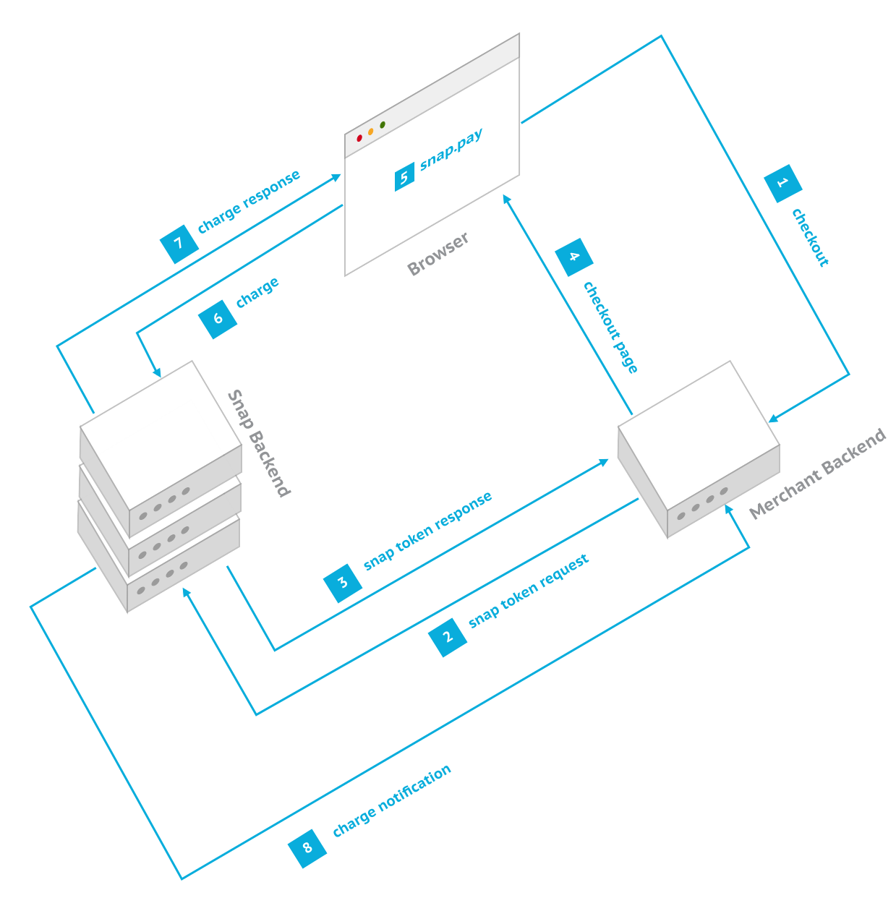

## About

Ini adalah contoh implementasi Payment Gateway Midtrans di Laravel. Contoh kasus yang diambil adalah web donasi online, semua sistem/manajemen donasi yang ada disini dibuat sesederhana mungkin agar kita bisa lebih fokus untuk mepelajari cara kerja Payment Gateway Midtransnya.

## Snap Midtrans Flow

<ol>
<li>User performs the checkout operation</li>
<li>Merchant server makes an <a href="#backend-integration">api request</a> to the snap backend to get the <code class="prettyprint">SNAP_TOKEN</code></li>
<li>Snap backend responds to the api call with the <code class="prettyprint">SNAP_TOKEN</code></li>
<li>Merchant server constructs the <a href="#summary">html</a> page and sends it back to the browser</li>
<li>User verifies the details and clicks the pay button. Merchant&rsquo;s javascript code calls <a href="#snap-js"><code class="prettyprint">snap.pay(SNAP_TOKEN, options)</code></a>. User then fills up the payment details and clicks the confirm button.</li>
<li>Snap JS sends the payment details to the snap backend</li>
<li>Snap backend processes the details and responds with the charge status. Snap JS then calls the corresponding <a href="#snap-js">callback</a> provided by the merchant&rsquo;s javascript code.</li>
<li>Snap backend notifies the merchant server about the charge status</li>
</ol>
